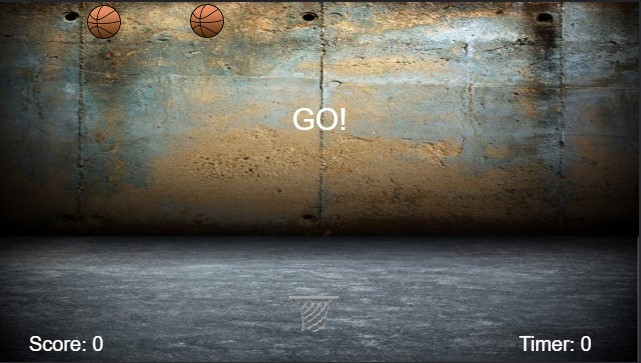

# global-game-jam-2016

# Droptime

This game was not part of the submitted work for GGJ 2016 but if your keen to try it, go to;

http://ec2-54-66-193-144.ap-southeast-2.compute.amazonaws.com:3001/droptime/

Collect as many basketballs in your basket before the 1 minute timer runs out.

- Play using a mobile device only.
- First touch should enable FullScreen mode (with your permission).
- Some apple devices are not prompting for full screen permissions and therefore cannot run the game properly.
- Must be played landscape mode.
- Full Offline support: the Game will still load and work when wifi and mobile network are disabled.

## Techonolgy Used;

- phaser.io (http://phaser.io/)
- HTML5 .appcache (for offline support)
- HTML5 localstorage (with browser cookie fallback)

## To run the game locally:

### For best experience;

- Ensure no other local server is running (nginx or apache) on localhost port 3001.
- run `npm install`
- Start the server using: `node server.js`
- visit http://localhost:3001/droptime/ in any mobile phone browser, or desktop browser emulating a mobile broswer.
- go landscape and tap once to start in fullscreen.

### Alternative, no server method;

Open /client/index.html in any desktop browser capable of emulating a mobile browser.
